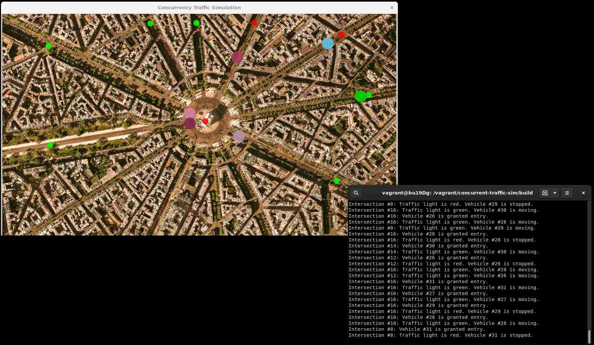

# A Concurrent Traffic Simulation
Objective: This is a completion of the concurrent traffic simulation project of a Udacity course on concurrent programming in C++.

## Description
This project is a traffic simulation that employs a graph model. Underlying an aerial view of a small section of a city, is a graph representing select streets and intersections. The edges of the graph are straight lines that represent the streets. The graph vertices represent the intersections. Vertices attached to only one line are "intersections" where vehicles make a U-turn. Vehicles are modeled by points that move on the graph. Each vehicle point is represented by a disc with that point at its center. Each intersection determines when a vehicle is allowed to cross that intersection according to each vehicle's order of arrival. Only one vehicle is allowed in an intersection zone at one time. An intersection zone, is a region of the graph that includes an intersection and 10% of the length of any street connected to that intersection. At each intersection, there is a traffic light, represented by a disc, smaller than a vehicle disc, with a color that is either green or red, the color having the usual meaning of indicating whether or not any vehicle can cross the associated intersection. Each traffic light changes its color after a randomly selected time period of between 4 and 6 seconds inclusive. The project execution employs a separate thread to concurrently process each vehicle, intersection and traffic light.

<br>
*Sample Execution Screenshot*

## Initial Environment
This project was initially completed on Bento/Ubuntu 19.04 with the following packages installed via package manager:
```
  build-essential
  cmake
  libgtk2.0-dev
  libavcodec-dev
  libavformat-dev
  libswscale-dev
```
and the following package installed manually: [opencv](https://github.com/opencv/opencv.git), which contains various C++ libraries. The last four packages listed above where particular to installing opencv manually. The opencv C++ libraries employed by this project are refernced by the headers `<opencv2/core.hpp>`, `<opencv2/imgproc.hpp>` and `<opencv2/highgui.hpp>`. The build-essential package included the GCC 8 compiler employed to compile the C++ code.

## Latest Environment
The project was migrated to a virtual machine having the Bento/Ubuntu 20.04 Linux distribution with the following packages installed via the APT package manager:
```
  gcc-10
  g++-10
  clang
  cmake
  libopencv-dev
```
The opencv C++ library headers are `<opencv2/core.hpp>`, `<opencv2/imgproc.hpp>` and `<opencv2/highgui.hpp>`. The project can be compiled according to the C++ 2020 standard, either with GCC 10 or LLVM 10 Clang.

## Execution

Given the latest environment above, in Bash, the project can be compiled by the following sequence of commands. Create the build directory.
```ShellSession
  mkdir build && cd build
```
Execute CMake. For the GCC 10 compiler, the command is:
```ShellSession
  cmake -D CMAKE_C_COMPILER=gcc-10 -D CMAKE_CXX_COMPILER=g++-10 ..
```
Alternatively, for the Clang 10 compiler, the command is:
```ShellSession
  cmake -D CMAKE_C_COMPILER=clang -D CMAKE_CXX_COMPILER=clang++ ..
```
Execute the generated Makefile.
```ShellSession
  make
```
The executable will be placed in the `build` directory. From within `build`, the project can then be run by executing the project executable:
```ShellSession
  ./traffic_simulation
```
